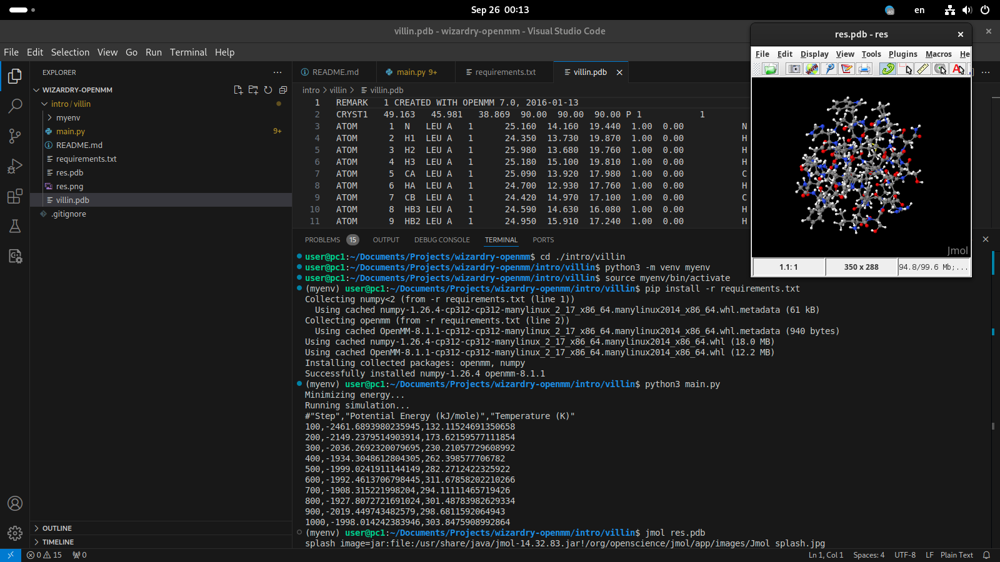

# wizardry-openmm

UNDER CONSTRUCTION

### Intro

For now, intro is available which will be a collection of attempts to understand OPENMM.

There, you can find villin, which is the official OPENMM "hello world", written in a personal style architecture which is easy to run.